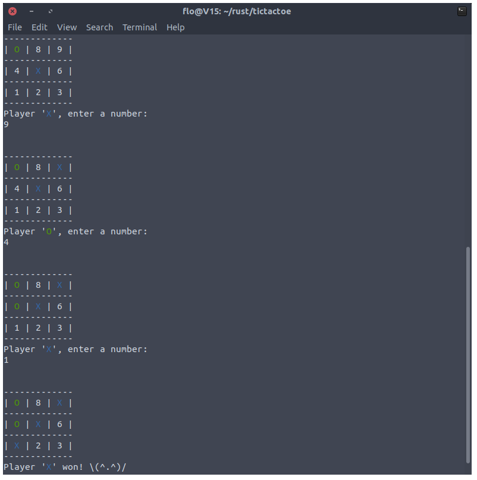

# tic-tac-toe_in_Rust

## Install
Go to the [latest release](https://github.com/flofriday/tictactoe/releases) and install the right binary for your system.

On Windows and macOS your computer might warn you because the binaries are not
singed. Feel free to ignore those warnings.

## Build
1. [Download](https://github.com/flofriday/tictactoe/archive/master.zip) the .zip or clone the project with git
2. [Install rust](https://www.rust-lang.org/en-US/install.html), if you have not already
3. Run `cargo run --release`
